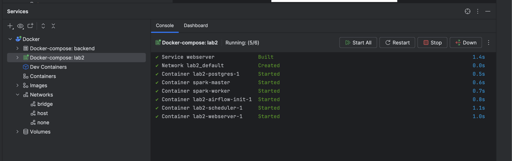

# Лабораторная работа 2: Airflow + Spark
# Lab 2: Airflow + Spark

##  Оглавление | Table of Contents
- [Установка | Installation](#-установка--installation)
- [Настройка Spark соединения | Spark Connection Setup](#-настройка-spark-соединения--spark-connection-setup)
- [Запуск | Running](#-запуск--running)
- [Скриншоты | Screenshots](#-скриншоты--screenshots)
- [Описание проекта | Project Description](#-описание-проекта--project-description)

---

## Установка | Installation
1.  Убедитесь, что установлены **Docker** и **Docker Compose**.  
    Make sure **Docker** and **Docker Compose** are installed.
2.  Клонируйте репозиторий | Clone the repository:

    ```sh
    git clone https://github.com/huynhduc0/itmo-lec-devops
    cd itmo-lec-devops/lab2
    ```
3.  Постройте Docker-образ | Build the Docker image:

    ```sh
    docker-compose build
    ```

## Настройка Spark соединения | Spark Connection Setup
1.  Запустите Airflow с помощью Docker Compose | Start Airflow with Docker Compose:

    ```sh
    docker-compose up -d
    ```

2.  Перейдите в веб-интерфейс Airflow | Open Airflow UI:

    [http://localhost:8080/](http://localhost:8080/)

    Логин | Login: `airflow`  
    Пароль | Password: `airflow`

3.  Создайте Spark-соединение в Airflow UI (Admin -> Connections) | Create a Spark connection in Airflow UI (Admin -> Connections):
    *   **Conn Id:** `spark_local`
    *   **Conn Type:** Spark
    *   **Host:** `spark://spark-master`
    *   **Port:** `7077`

## Запуск | Running

1.  Включите DAG `spark_example` в Airflow UI | Enable the `spark_example` DAG in the Airflow UI.
2.  Запустите DAG | Trigger the DAG.
3.  Отслеживайте выполнение DAG в Airflow UI | Monitor the DAG run in the Airflow UI.
4.  Просмотрите сведения о задаче Spark в Spark UI | View the Spark job details in the Spark UI:

    [http://localhost:4040/](http://localhost:4040/)

## Скриншоты | Screenshots

1.  DAG Runs
    
    

2.  Spark UI
    
3. Container
   
## Описание проекта | Project Description
Этот проект интегрирует Apache Airflow с Apache Spark для выполнения Spark-задач в рамках DAG.  
This project integrates Apache Airflow with Apache Spark to execute Spark jobs as part of a DAG.

### Структура проекта | Project Structure

```bash
airflow-spark-lab/
│── dags/                  # Папка с DAG-ами | DAGs folder
│   └── spark_dag.py       # Пример DAG | Example DAG
│── spark/                 # Папка со Spark-задачами | Spark jobs folder
│   └── task.py       # Пример Spark-задачи | Example Spark job
│── img/                # Папка с изображениями для документации | Images for documentation
│── Dockerfile             # Конфигурация Docker-образа | Docker image configuration
│── docker-compose.yml     # Конфигурация Docker Compose | Docker Compose configuration
│── README.md              # Этот файл | This file
│── CHANGES.md             # История изменений | Changelog